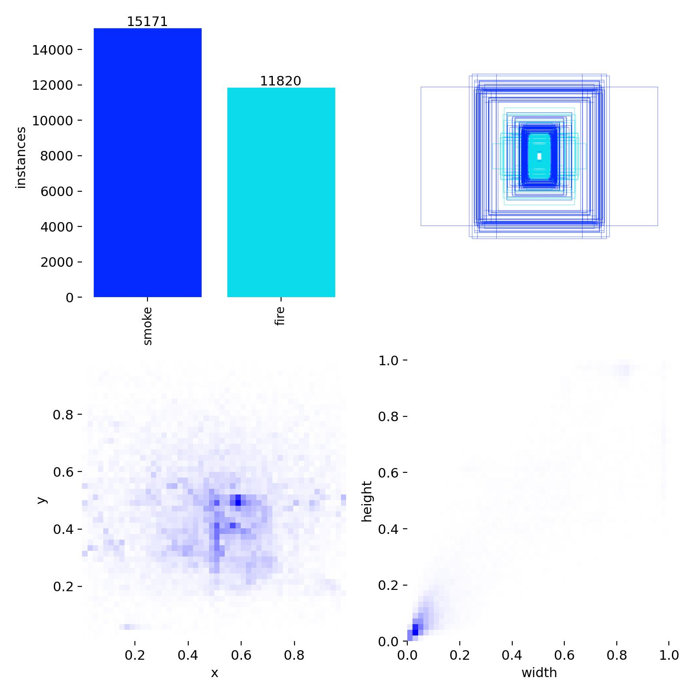

# 🔥 Fire and Smoke Detection using YOLO11

<div align="center">

**An Industrial-Grade Fire and Smoke Detection System powered by YOLO11**


</div>

---

## 📋 Table of Contents

- [Overview](#-overview)
- [Key Features](#-key-features)
- [Dataset](#-dataset)
- [Model Architecture](#-model-architecture--training)
- [Performance Results](#-performance-results)
- [Installation](#-installation)
- [Usage](#-usage)
- [Project Structure](#-project-structure)
- [Code & Notebooks](#-code--notebooks)
- [Deployment](#-deployment)
- [Future Enhancements](#-future-enhancements)
- [Contributing](#-contributing)
- [License](#-license)
- [Author](#-author)

---

## 🎯 Overview

This project presents a **state-of-the-art fire and smoke detection system** built on the YOLO11 architecture. Designed for real-world deployment, the model achieves **82.1% mAP@50** on diverse test scenarios including challenging conditions with clouds, fog, varying lighting, and night-time environments.

### 🎓 Objective

Develop an industrial-grade detection system capable of:
- ✅ Detecting both **fire** and **smoke** with high accuracy
- ✅ Performing reliably in various environmental conditions
- ✅ Minimizing false positives from clouds, fog, and visual noise
- ✅ Working effectively in day and night scenarios
- ✅ Real-time inference capability (~107 FPS potential)

### 📊 Visual Overview


*Class distribution and bounding box characteristics from the training dataset*

---

## ✨ Key Features

- 🔥 **High Accuracy**: 82.1% mAP@50 overall, 89.0% for smoke detection
- 🚀 **Real-Time Performance**: ~9.3ms inference time per image
- 💪 **Robust Training**: 29,752 diverse images with strategic negative examples
- 🌙 **Night Detection**: Optimized HSV augmentation for low-light scenarios
- ☁️ **False Positive Reduction**: 37.6% negative examples to handle clouds/fog
- 🎯 **Production Ready**: Complete deployment pipeline and documentation
- 📦 **Open Datasets**: Publicly available on Kaggle

---

## 📦 Dataset

### Dataset Statistics

The model was trained on **dataset_split-V1**, a carefully curated multi-source dataset:

| Split     | Total Images | Empty (Negatives)  |
| --------- | ------------ | ------------------ |
| **Train** | 23,801       | 8,973              |
| **Valid** | 2,975        | 1,117              |
| **Test**  | 2,976        | 1,089              |
| **TOTAL** | **29,752**   | **11,179 (37.6%)** |

**Access Dataset on Kaggle**: [Fire-Smoke Detection Dataset V1](https://kaggle.com/datasets/d3fc9e12b96c5a5914484f13338a0f0d2a9c41afc1efcad85784636ed7a38b9a)

### Data Sources

The dataset was aggregated from four high-quality sources:

1. **[aiformankind/wildfire-smoke-dataset](https://github.com/aiformankind/wildfire-smoke-dataset)** - Wildfire smoke with Pascal VOC annotations
2. **[CQU Annotated Fire-Smoke Dataset](https://acquire.cqu.edu.au/articles/dataset/Annotated_Fire_-Smoke_Image_Dataset)** - Professional-grade annotations
3. **[Kaggle Smoke-Fire Detection](https://www.kaggle.com/datasets/sayedgamal99/smoke-fire-detection-yolo)** - Pre-formatted YOLO dataset
4. **[Etsin Fairdata Fire Detection](https://etsin.fairdata.fi/dataset/1dce1023-493a-4d63-a906-f2a44f831898/data)** - Research-grade Finnish dataset

### Class Distribution

- **Class 0**: Smoke 🌫️
- **Class 1**: Fire 🔥

### Key Dataset Features

- **Diverse Resolutions**: 3,368 unique image resolutions (from 480×360 to 4096×2160)
- **Multi-Environment**: Urban, forest, industrial, and CCTV scenarios
- **Strategic Negatives**: 11,179 background images to reduce false positives
- **Quality Assurance**: Corrupt images restored, invalid annotations removed

### Format Conversion

Datasets in Pascal VOC XML format were converted to YOLO using our custom converter:

```python
from voc_to_yolo_converter import VOCtoYOLOConverter

converter = VOCtoYOLOConverter(class_mapping={'smoke': 0, 'fire': 1})
converter.convert_dataset(
    voc_annotations_dir='path/to/voc/annotations',
    images_dir='path/to/images',
    output_dir='path/to/yolo_dataset',
    copy_images=True
)
```

---

## 🏗️ Model Architecture & Training

### Architecture Specifications

- **Model**: YOLO11m (Medium variant)
- **Parameters**: 20,054,550
- **GFLOPs**: 68.2
- **Layers**: 231
- **Input Size**: 640×640

### Training Configuration

```yaml
# Core Settings
epochs: 100
batch_size: 16
optimizer: AdamW
learning_rate: 0.001 (cosine decay)
warmup_epochs: 3.0

# Augmentation Strategy
hsv_h: 0.015          # Hue variation
hsv_s: 0.7            # Saturation variation
hsv_v: 0.4            # Value variation (night simulation)
mosaic: 1.0           # Critical for small smoke detection
mixup: 0.1            # Blending augmentation
degrees: 10.0         # Rotation (UAV robustness)
fliplr: 0.5           # Horizontal flip
close_mosaic: 10      # Disable mosaic in last 10 epochs
```

### Training Environment

- **Platform**: Kaggle GPU Environment (Tesla P100 16GB)
- **Framework**: Ultralytics YOLO 8.3.x
- **PyTorch**: 2.6.0+cu124

### Training Strategy Highlights

1. **AdamW Optimizer**: Stable convergence for complex fire/smoke patterns
2. **Aggressive HSV Augmentation**: Enhanced night/low-light performance
3. **Mosaic Priority**: Improved small object detection
4. **Progressive Training**: 100 epochs with strategic augmentation scheduling

---

## 📈 Performance Results

### Overall Performance

| Metric        | Score     |
| ------------- | --------- |
| **mAP@50**    | **82.1%** |
| **mAP@50-95** | **51.6%** |
| Precision     | 81.3%     |
| Recall        | 74.2%     |

### Per-Class Performance

| Class     | Precision | Recall | mAP@50    | mAP@50-95 |
| --------- | --------- | ------ | --------- | --------- |
| **Smoke** | 88.8%     | 80.9%  | **89.0%** | 61.6%     |
| **Fire**  | 73.7%     | 67.4%  | 75.3%     | 41.6%     |

### Inference Speed

**Per Image Performance**:
- Preprocess: 0.6 ms
- Inference: 8.3 ms (GPU)
- Postprocess: 0.4 ms
- **Total**: ~9.3 ms (**~107 FPS potential**)

### Dataset Comparison: V1 vs V2

| Metric        | V1 (YOLO11m) 29K images | V2 (YOLO11l) 11K images | Advantage  |
| ------------- | ----------------------- | ----------------------- | ---------- |
| **mAP@50**    | **82.1%**               | 70.9%                   | **+11.2%** |
| **mAP@50-95** | **51.6%**               | 43.3%                   | **+8.3%**  |
| **Precision** | **81.3%**               | 72.0%                   | **+9.3%**  |

> **Key Insight**: Despite using a smaller model (YOLO11m), Dataset V1 significantly outperforms V2, demonstrating the critical importance of dataset quality over quantity.

---

## 🛠️ Installation

### Prerequisites

- Python 3.8+
- CUDA-capable GPU (recommended)
- 8GB+ RAM

### Setup Instructions

1. **Clone the Repository**

```bash
git clone https://github.com/SahiL911999/Fire-Smoke-Detection-using-YOLO11.git
cd Fire-Smoke-Detection-using-YOLO11
```

2. **Install Dependencies**

```bash
pip install ultralytics opencv-python pillow numpy
```

3. **Download Model Weights**

The trained model weights (`best.pt` - 115.5 MB) are included in the repository or can be downloaded separately.

---

## 🚀 Usage

### Basic Inference

```python
from ultralytics import YOLO

# Load the trained model
model = YOLO('best.pt')

# Run inference on an image
results = model('path/to/image.jpg')

# Display results
results[0].show()

# Save results
results[0].save('output.jpg')
```

### Batch Inference

```python
# Run on multiple images
results = model(['image1.jpg', 'image2.jpg', 'image3.jpg'])

# Process results
for result in results:
    boxes = result.boxes  # Bounding boxes
    for box in boxes:
        class_id = int(box.cls[0])
        confidence = float(box.conf[0])
        coords = box.xyxy[0].tolist()
        print(f"Class: {class_id}, Conf: {confidence:.2f}, Box: {coords}")
```

### Video Inference

```python
# Process video file
results = model('path/to/video.mp4', stream=True)

for result in results:
    result.show()  # Display frame
```

### Production Settings

```python
# Recommended deployment configuration
results = model(
    'image.jpg',
    conf=0.25,  # Confidence threshold
    iou=0.45,   # NMS IoU threshold
    imgsz=640   # Input image size
)
```

---

## 🗂️ Project Structure

```
Fire-Smoke-Detection-using-YOLO11/
│
├── 📁 Code/                              # Development notebooks & scripts
│   ├── dataset_V1_EDA.ipynb             # Primary dataset analysis
│   ├── dataset_V2_EDA.ipynb             # Secondary dataset exploration
│   ├── dataset_filtering.ipynb          # Fire-only filtering
│   ├── dataset_filtering_both.ipynb     # Fire+Smoke filtering
│   ├── dataset_label_swap.ipynb         # Label manipulation
│   ├── voc_to_yolo_converter.py         # Pascal VOC to YOLO converter
│   ├── smoke-fire-v1.ipynb              # Primary training notebook
│   └── smoke-fire-v2.ipynb              # Comparative training notebook
│
├── 🤖 best.pt                            # Trained model weights (115.5 MB)
├── 📊 labels.jpg                         # Label distribution visualization
├── 📄 Report.md                          # Comprehensive project report
├── 📄 Report.pdf                         # PDF version of report
├── 📋 LICENSE                            # MIT License
└── 📖 README.md                          # This file
```

---

## 💻 Code & Notebooks

### Exploratory Data Analysis (EDA)

- **`dataset_V1_EDA.ipynb`**: Comprehensive analysis of the primary training dataset
  - Class distribution analysis
  - Bounding box statistics
  - Image resolution breakdown
  - Negative example exploration

- **`dataset_V2_EDA.ipynb`**: Secondary dataset exploration for comparison

### Dataset Filtering Tools

- **`dataset_filtering.ipynb`**: Extract images containing Fire class only
- **`dataset_filtering_both.ipynb`**: Extract images with both Fire AND Smoke
- **`dataset_label_swap.ipynb`**: Class label manipulation for experimentation

### Training Notebooks

- **`smoke-fire-v1.ipynb`**: Primary training pipeline on dataset_split-V1
  - Complete training configuration
  - Checkpoint management
  - Validation and testing
  - Performance visualization

- **`smoke-fire-v2.ipynb`**: Comparative training on dataset_split-V2

### Data Conversion

- **`voc_to_yolo_converter.py`**: Convert Pascal VOC XML annotations to YOLO format
  - Automated coordinate transformation
  - Batch processing capability
  - Validation and error handling

---

## 🌐 Deployment

### Production Requirements

**Input Specifications**:
- Image Size: 640×640 (auto-resized)
- Formats: JPEG, PNG, BMP
- Color Space: RGB

**Output Format**:
- Bounding boxes: [x1, y1, x2, y2]
- Class IDs: 0 (Smoke), 1 (Fire)
- Confidence scores: [0.0, 1.0]

### Recommended Settings

```python
# For Production Deployment
confidence_threshold = 0.25  # Balance precision/recall
iou_threshold = 0.45         # Standard NMS
```

### Use Cases

✅ **Forest Fire Early Warning Systems**  
✅ **Industrial Safety Monitoring**  
✅ **UAV/Drone-based Fire Detection**  
✅ **Smart City CCTV Integration**  
✅ **Wildfire Management Systems**  
✅ **Building Fire Alarm Systems**

### Integration Example

```python
import cv2
from ultralytics import YOLO

class FireSmokeDetector:
    def __init__(self, model_path='best.pt'):
        self.model = YOLO(model_path)
        
    def detect(self, image_path, conf_threshold=0.25):
        results = self.model(image_path, conf=conf_threshold)
        
        detections = []
        for result in results:
            for box in result.boxes:
                detection = {
                    'class': 'Smoke' if int(box.cls[0]) == 0 else 'Fire',
                    'confidence': float(box.conf[0]),
                    'bbox': box.xyxy[0].tolist()
                }
                detections.append(detection)
        
        return detections

# Usage
detector = FireSmokeDetector()
detections = detector.detect('suspect_image.jpg')

for det in detections:
    print(f"Alert: {det['class']} detected with {det['confidence']:.2%} confidence")
```

---

## 🔮 Future Enhancements

### Planned Improvements

1. **Multi-Scale Detection**
   - Further optimize for very small smoke detection
   - Enhanced anchor box strategies

2. **Temporal Integration**
   - Leverage video sequences for tracking
   - Temporal consistency in detection

3. **Weather Condition Adaptation**
   - Specific training for rain, snow, and extreme weather
   - Enhanced robustness in diverse climates

4. **Night Mode Enhancement**
   - Additional low-light training data
   - Infrared/thermal image integration

5. **Model Optimization**
   - Quantization for edge deployment
   - ONNX export for cross-platform compatibility
   - TensorRT optimization for NVIDIA devices

6. **Extended Capabilities**
   - Severity estimation (early stage vs. fully developed)
   - Distance estimation for fire/smoke sources
   - Multi-camera tracking and triangulation

---

## 🤝 Contributing

Contributions are welcome! If you'd like to improve this project:

1. Fork the repository
2. Create a feature branch (`git checkout -b feature/improvement`)
3. Commit your changes (`git commit -am 'Add new feature'`)
4. Push to the branch (`git push origin feature/improvement`)
5. Open a Pull Request

### Areas for Contribution

- Additional dataset sources
- Performance optimizations
- Deployment tools and scripts
- Documentation improvements
- Bug fixes and testing

---

## 📄 License

This project is licensed under the **MIT License** - see the [LICENSE](LICENSE) file for details.

---

## 🙏 Acknowledgements

### Dataset Sources

Special thanks to the following organizations and researchers for making their datasets publicly available:

- **AI For Mankind**: [wildfire-smoke-dataset](https://github.com/aiformankind/wildfire-smoke-dataset)
- **Central Queensland University**: [CQU Annotated Fire-Smoke Dataset](https://acquire.cqu.edu.au/articles/dataset/Annotated_Fire_-Smoke_Image_Dataset)
- **Kaggle Contributors**: [sayedgamal99](https://www.kaggle.com/datasets/sayedgamal99/smoke-fire-detection-yolo)
- **Etsin Fairdata**: Finnish fire detection research dataset

### Tools & Frameworks

- **[Ultralytics YOLO](https://github.com/ultralytics/ultralytics)**: For the excellent YOLOv11 implementation
- **[PyTorch](https://pytorch.org/)**: Deep learning framework
- **[Kaggle](https://www.kaggle.com/)**: GPU compute resources and dataset hosting

---

## 👨‍💻 Author

**Sahil Ranmbail**

This project represents a comprehensive effort in developing industrial-grade fire and smoke detection capabilities using state-of-the-art deep learning techniques. From meticulous dataset curation to optimized model training, every aspect has been carefully designed for real-world deployment.

For technical inquiries or deployment support, please refer to the training notebooks and configuration files included in this repository.

---

<div align="center">

**🔥 Fire and Smoke Detection using YOLO11 🔥**

*Protecting lives and property through intelligent detection*

**Project Status**: ✅ **COMPLETE & READY FOR DEPLOYMENT**


</div>
